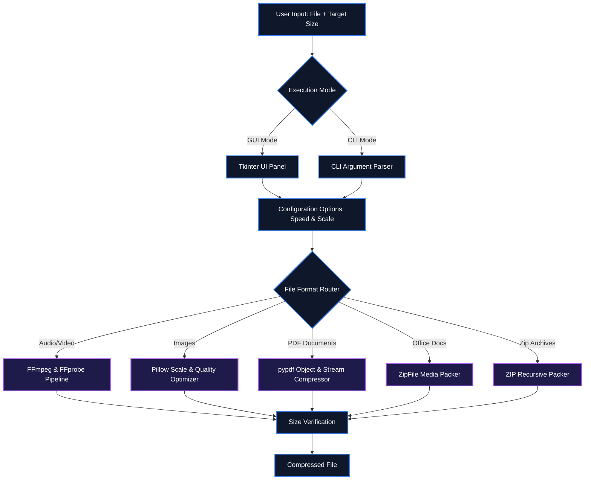

# ⚡ Media Compressor (v0.3)

[](https://www.python.org/)
[](https://ffmpeg.org/)
[](https://python-pillow.org/)
[](https://pypi.org/project/pypdf/)
[](https://pyinstaller.org/)
[](https://creativecommons.org/publicdomain/zero/1.0/)

A premium, multi-format compression utility featuring a clean desktop GUI and a powerful command-line interface. Precisely compress audio, video, images, PDFs, Office documents, and ZIP archives to fit target sizes (such as **15MB** limits for messaging systems, email attachments, or web uploads).

---

## 📖 Table of Contents
- [Key Features](#-key-features)
- [System Architecture](#-system-architecture)
- [Quick Setup & Installation](#-quick-setup--installation)
- [How to Use](#-how-to-use)
  - [Option A: Graphical Interface (GUI)](#option-a-graphical-interface-gui)
  - [Option B: Command-Line Interface (CLI)](#option-b-command-line-interface-cli)
- [Standalone Executable Build (`.exe`)](#-standalone-executable-build-exe)
- [License](#-license)

---

## ✨ Key Features

- 📁 **Universal Format Support**: 
  - **Audio**: `.mp3`, `.m4a`, `.wav`, `.flac`, `.ogg`, `.aac`, `.wma`
  - **Video**: `.mp4`, `.mkv`, `.avi`, `.mov`, `.webm`, `.flv`, `.wmv`
  - **Images**: `.jpg`, `.jpeg`, `.png`, `.gif`, `.webp`, `.bmp`, `.tiff`
  - **PDF Documents**: `.pdf`
  - **Office Documents**: `.docx`, `.pptx`, `.xlsx`
  - **Archives**: `.zip`
- 🎨 **Tkinter Clam Theme UI**: A clean, responsive dashboard designed for desktop convenience.
- 🎯 **Precise Target Size Allocation**: Iteratively calculates bitrates, downscales resolution, and adjusts quality variables to fit output sizes strictly under limits (with a built-in safety headroom).
- ⏩ **Speed Adjustments (v0.3)**: 
  - Change speed factor of audio and video from `0.5x` to `3.0x` using a slider.
  - Automatically chains FFmpeg's `atempo` filters for speeds > 2.0x to preserve audio pitch and synchronization.
  - Real-time duration preview shows the output length (`Original` ➔ `Expected`) before processing.
- 📐 **Image Resizing (v0.3)**: 
  - Scale image dimensions from `10%` to `100%` using a slider.
  - Live width × height pixel resolution preview dynamically calculates dimensions as you slide.
- ⚙️ **Smart Document & Archive Compression**:
  - Treats `.docx`, `.pptx`, and `.xlsx` files as OpenXML zip packages, extracting and optimizing only internal media assets (`word/media`, `ppt/media`, `xl/media`). This shrinks the document dramatically with 100% formatting and text integrity preserved.
  - Compresses PDF streams and internal images using `pypdf`'s object optimization.
  - Automatically unzips `.zip` archives, recursively compresses all compressible media files (images, audio, video, documents) inside using a relative target size budget, and re-packages them.
- 💻 **Dual Mode**: Starts as a graphical user interface, or runs as a CLI for developer batch operations.

---

## ⚙️ System Architecture

The following block diagram illustrates the routing and processing pipelines of the compressor:



---

## 🚀 Quick Setup & Installation

This utility requires **Python 3.8+** and **FFmpeg** installed on your system.

### 1️⃣ Install Python
- **Windows / macOS**: Download and run the official installer from [python.org](https://www.python.org/downloads/). During installation on Windows, **make sure to check "Add Python to PATH"**.
- **Linux**: Usually pre-installed. If not, run:
  ```bash
  sudo apt install python3 python3-pip
  ```

### 2️⃣ Install Python Libraries
Install the core dependencies:
```bash
pip install Pillow pypdf
```

### 3️⃣ Install FFmpeg
The tool relies on FFmpeg for audio/video processing. Install it using the standard method for your OS:

- **Windows** (via PowerShell as Administrator):
  ```powershell
  winget install Gyan.FFmpeg
  ```
  *(Restart your computer or terminal after installation completes).*
  
- **macOS** (via Homebrew):
  ```bash
  brew install ffmpeg
  ```

- **Linux** (Debian/Ubuntu):
  ```bash
  sudo apt update && sudo apt install ffmpeg
  ```

---

## 🛠️ How to Use

### Option A: Graphical Interface (GUI)
Run the script to open the interactive utility panel:
```bash
python compress.py
```
1. Select your input file.
2. If it is an audio/video file, use the **Speed settings** slider to speed up/slow down the file.
3. If it is an image, use the **Image Resize** slider to scale the resolution.
4. Set the target size in MB, and click **Start Compression**.

### Option B: Command-Line Interface (CLI)
For batch tasks or scripting:
```bash
# Compress a video to a standard 15MB target at 1.5x speed (saves to c:\Dev\tools\Compress\DONE)
python compress.py input.mp4 -s 1.5

# Compress and resize an image to 50% scale under 2MB
python compress.py input.jpg output_dir 2.0 -r 0.5

# Compress a PDF file to a custom target of 5MB in a specific directory
python compress.py input.pdf output_dir 5.0
```

---

## 📦 Standalone Executable Build (`.exe`)

You can compile a portable, single-file Windows executable that runs without requiring Python installed:

1. Install PyInstaller:
   ```bash
   pip install pyinstaller
   ```
2. Build the executable:
   ```bash
   pyinstaller --onefile --noconsole --name "MediaCompressor" compress.py
   ```
3. Your portable executable will be created in the `dist/` directory as `MediaCompressor.exe`.

---

## 📄 License
This repository is licensed under the [CC0 1.0 Universal (CC0 1.0) Public Domain Dedication](LICENSE).
